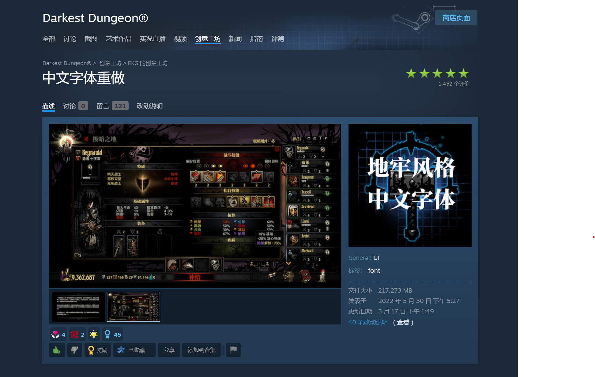
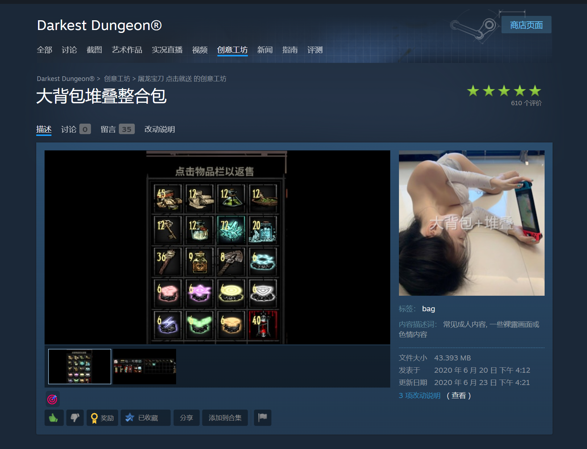
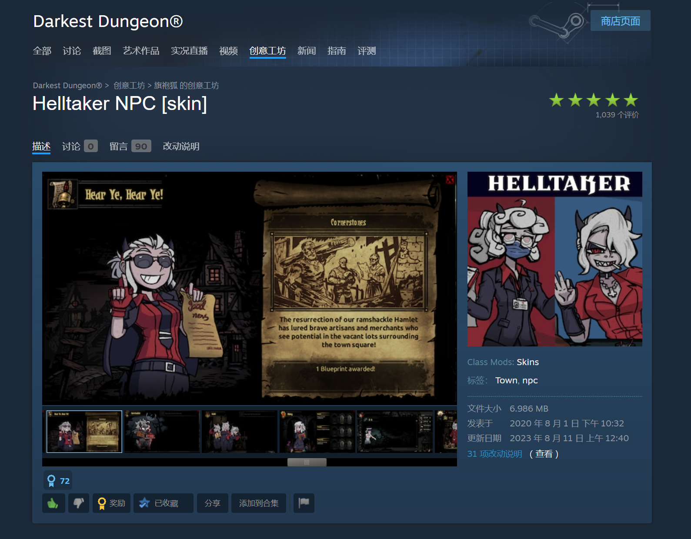
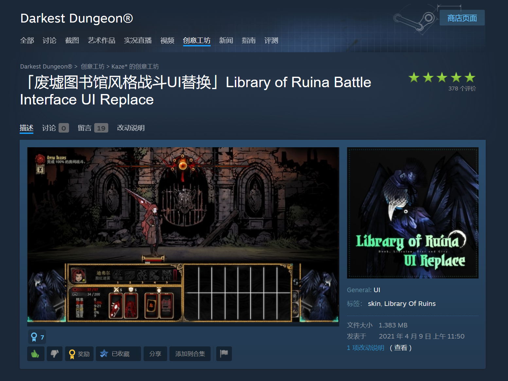

## 英雄中英文名对照

|英文|中文|英文|中文|英文|中文|
|:---:|:---:|:---:|:---:|:---:|:---:|
|Abomination|[咒缚者](#abomination-咒缚者)|Grave robber|[盗墓贼](#grave-robber-盗墓贼)|Man at arms|[老兵](#man-at-arms-老兵)|
|Antiquarian|[古董商](#antiquarian-古董商)|Hellion|[恶女](#hellion-恶女)|Musketeer|[火枪手](#musketeer-火枪手)|
|Arbalest|[弩手](#arbalest-弩手)|Highwayman|[强盗](#highwayman-强盗)|Occultist|[神秘学者](#occultist-神秘学者)|
|Bounty hunter|[赏金猎人](#bounty-hunter-赏金猎人)|Houndmaster|[训犬师](#houndmaster-训犬师)|Plaque Doctor|[瘟疫医生](#plaque-doctor-瘟疫医生)|
|Crusader|[十字军](#crusader-十字军)|Jester|[小丑](#jester-小丑)|Shieldbreaker|[破盾者](#shieldbreaker-破盾者)|
|Flagellant|[苦修](#flagellant-苦修)|Leper|[麻风](#leper-麻风)|Vestal|[修女](#vestal-修女)|

## 英雄皮肤mod

### Abomination 咒缚者

### Grave robber 盗墓贼

### Man at arms 老兵

### Antiquarian 古董商

### Hellion 恶女

### Musketeer 火枪手

### Arbalest 弩手

### Highwayman 强盗

### Occultist 神秘学者

### Bounty hunter 赏金猎人

### Houndmaster 训犬师

### Plaque Doctor 瘟疫医生

### Crusader 十字军

### Jester 小丑

### Shieldbreaker 破盾者

### Flagellant 苦修

### Leper 麻风

### Vestal 修女

## 字体

### 中文字体重做

[链接：https://steamcommunity.com/sharedfiles/filedetails/?id=2814682822](https://steamcommunity.com/sharedfiles/filedetails/?id=2814682822)

## 机制

### 大背包堆叠整合包

[链接：https://steamcommunity.com/sharedfiles/filedetails/?id=2135686607](https://steamcommunity.com/sharedfiles/filedetails/?id=2135686607)

## UI 界面

### NPC

#### Helltaker NPC \[skin\]

[链接：https://steamcommunity.com/sharedfiles/filedetails/?id=2184315231](https://steamcommunity.com/sharedfiles/filedetails/?id=2184315231)

### 战斗 UI

#### 「废墟图书馆风格战斗UI替换」Library of Ruina Battle Interface UI Replace

[链接：https://steamcommunity.com/sharedfiles/filedetails/?id=2451087872](https://steamcommunity.com/sharedfiles/filedetails/?id=2451087872)

### 地图背景

#### Immersive Area Backgrounds

[链接：https://steamcommunity.com/workshop/filedetails/?id=3362582428](https://steamcommunity.com/workshop/filedetails/?id=3362582428)

